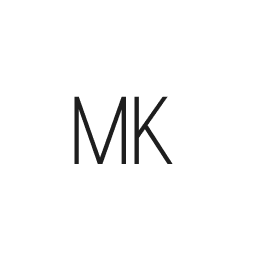

 
<h3>
 MK Ecommerce - An Online Shopping
</h3>

My latest project showcasing modern e-commerce technology.

  <a href="#" target="_blank">
    Preview
  </a>
  &nbsp;✦&nbsp;
  <a href="#-getting-started">
    Getting Started
  </a>
  &nbsp;✦&nbsp;
  <a href="#-commands">
    Commands
  </a>
  &nbsp;✦&nbsp;
  <a href="#-license">
    License
  </a>
  &nbsp;✦&nbsp;
  &nbsp;✦&nbsp;
  <a href="https://twitter.com/maikolaguilar11">
    Twitter
  </a>

## 🛠️ Stack

- [**Next.js**](https://nextjs.org/) - React framework for building JavaScript applications.
- [**Shopify**](https://www.shopify.com/) - Commerce platform that allows anyone to set up an online store.
- [**Tailwindcss**](https://tailwindcss.com/) - A utility-first CSS framework for rapidly building custom designs.
- [**shadcn + daisyUI**](https://daisyui.com/) - Theming plugin for Tailwind CSS.
- [**Clerk.js**](https://clerk.dev/) - User authentication and management for your app.

## 🚀 Getting Started

1. Fork or clone this repository.
2. npm install.
3. npm run dev.
4. Open [**http://localhost:3000**](http://localhost:3000/) with your browser to see the result 🚀

### 🤝 Contributing

<a href="https://github.com/maikcyphlock/ecommerce-mik/graphs/contributors">
 
</a>

## 🧞 Commands

|   | Command     | Action                    |
| :-- | :--------------- | :-------------------------------------------- |
| ⚙️ | `dev` or `start` | Starts local dev server at `localhost:3000`. |
| ⚙️ | `build`     | Build your production site to `./dist/`.   |
| ⚙️ | `preview`    | Preview your build locally, before deploying. |

## 🔑 License

[MIT](#) - Created by [**maikcyphlock**](https://twitter.com/maikolaguilar11).

